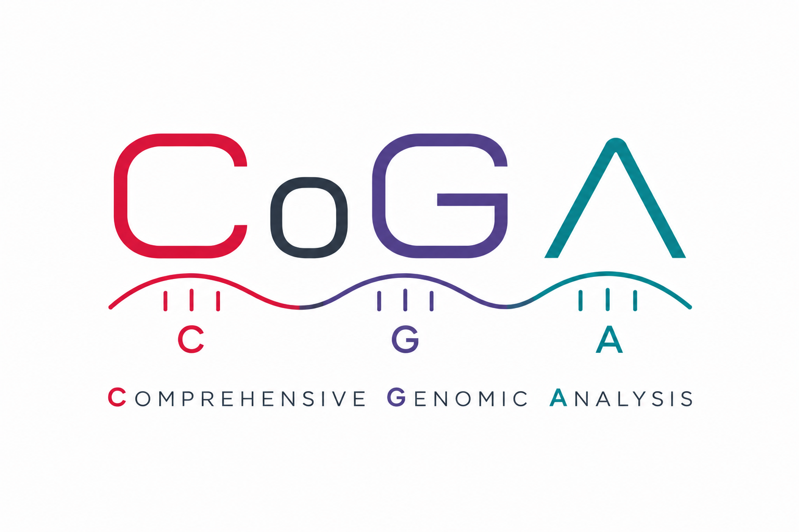

# CoGA

CoGA, Comprehensive Genomic Analysis, is a unified platform for variant interpretation, genome visualization, and clinically oriented genomic review. It combines a FastAPI backend, a React frontend, `Postgres` for metadata and review state, and `ClickHouse` for high-volume variant storage.

## Stack

- `frontend/`: React, TypeScript, Vite, Tailwind.
- `backend/`: FastAPI, SQLAlchemy async, ClickHouse client.
- `Postgres`: users, projects, families, samples, review state, repeat expansions, gene cache, panels, interval tracks.
- `ClickHouse`: small variants and structural variants stored per assembly using CoGA tables.

## Quick Start

1. Copy `.env.example` to `.env`.
  The production-style stack now refuses to start with placeholder secrets. Replace `SECRET_KEY`, `POSTGRES_PASSWORD`, and `ADMIN_PASSWORD` before using `docker compose up`.
2. Start the production-style local stack:

```bash
docker compose up --build -d
```

1. Open:

- Frontend: `http://localhost:3000`
- Backend docs: `http://localhost:8000/docs`
- Postgres: `localhost:5432`
- ClickHouse HTTP: `localhost:8123`
- ClickHouse native: `localhost:9000`

## Local Development

Docker dev stack with backend reload and the Vite dev server:

```bash
docker compose -f docker-compose.yml -f docker-compose.dev.yml up --build -d
```

Stop either Docker stack:

```bash
docker compose down
```

Backend:

```bash
cd backend
python -m venv .venv
. .venv/bin/activate
pip install -r requirements.txt
export APP_ENV=development
uvicorn app.main:app --reload --host 0.0.0.0 --port 8000
```

Frontend:

```bash
cd frontend
npm install
npm run dev
```

## Environment

Required:

- `APP_ENV`
- `SECRET_KEY`
- `POSTGRES_HOST`
- `POSTGRES_PORT`
- `POSTGRES_DB`
- `POSTGRES_USER`
- `POSTGRES_PASSWORD`
- `CLICKHOUSE_HOST`
- `CLICKHOUSE_HTTP_PORT`
- `CLICKHOUSE_DATABASE`
- `CLICKHOUSE_USER`
- `CLICKHOUSE_PASSWORD`

Optional:

- `CORS_ORIGINS`
- `CORS_ORIGIN_REGEX`
- `ADMIN_USERNAME`
- `ADMIN_PASSWORD`
- `ADMIN_EMAIL`
- `VITE_API_BASE_URL` for pointing the frontend at a non-default API host
- `GITHUB_REPOSITORY`
- `GITHUB_REPOSITORY_URL`
- `GITHUB_RELEASES_URL`
- `GITHUB_ISSUES_URL`
- `GITHUB_API_TOKEN` for private-repository release sync
- `GITHUB_REPO_VISIBILITY`
- `GITHUB_RELEASE_CACHE_TTL_SECONDS`
- `GENE_REFERENCE_CLINGEN_VALIDITY_URL`
- `GENE_REFERENCE_CLINGEN_DOSAGE_URL`
- `GENE_REFERENCE_GENCC_URL`
- `GENE_REFERENCE_CLINVAR_GENE_CONDITION_URL`
- `GENE_REFERENCE_DBNSFP_GENE_PATH`
- `READS_PATH`
- `REFERENCE_FASTA_PATH`
- `REFERENCE_ALIAS_PATH`
- `REFERENCE_CYTOBAND_PATH`
- `AZURE_TENANT_ID`
- `AZURE_CLIENT_ID`
- `AZURE_ADMIN_OVERRIDE`
- `AUDIT_LOG_MODE`
- `AUDIT_LOG_QUERY_STRING_MODE`

## Data Loading

Reference data is loaded through admin API endpoints:

- `POST /assemblies/{assembly_id}/reference-upload/cytobands`
- `POST /assemblies/{assembly_id}/reference-upload/genes`
- `POST /assemblies/{assembly_id}/reference-upload/blacklist`
- `POST /assemblies/{assembly_id}/reference-upload/clinical_cnvs`

Pedigree and assay data are loaded through API uploads:

- `POST /ped/upload`
- `POST /families/{family_id}/small-variants/upload`
- `POST /repeat-expansions/upload/{sample_id}`
- `POST /bed/upload/{sample_id}/{bed_type}`
- `POST /structural-variants/upload/{sample_id}`

See [docs/data-import.md](docs/data-import.md) for the current flow.

## Validation

Backend tests:

```bash
backend/.venv/bin/python -m pytest
```

Frontend checks:

```bash
cd frontend
npm run tsc
npm run lint
npm test
npm run build
```

## Docs

- [docs/storage-architecture.md](docs/storage-architecture.md)
- [docs/database.md](docs/database.md)
- [docs/development.md](docs/development.md)
- [docs/application-scheme.md](docs/application-scheme.md)
- [docs/data-import.md](docs/data-import.md)

## Notes

- Variant IDs exposed by the API are storage-agnostic strings. Metadata IDs are UUIDs.
- Startup seeds the built-in repeat catalog into Postgres and starts the gene-reference refresh worker.
- Admin users can inspect and repair ClickHouse variant tables from the data-management page or via `/admin/clickhouse/variants`, `/admin/clickhouse/variants/{assembly_name}/ensure`, and `/admin/clickhouse/variants/{assembly_name}/optimize`.
- The in-app `New features` page reads GitHub releases through `/product/releases`; private repositories require `GITHUB_API_TOKEN` on the backend to keep that page synced.

