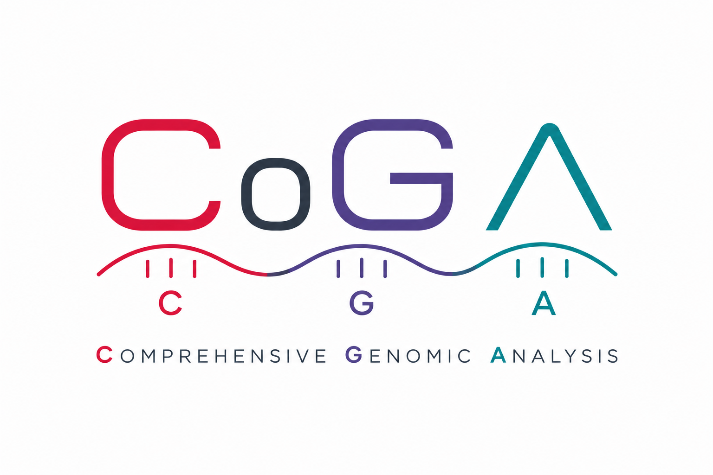

# CoGA

CoGA, Comprehensive Genomic Analysis, is a unified platform for variant interpretation, genome visualization, and clinically oriented genomic review. It combines a FastAPI backend, a React frontend, `Postgres` for metadata and review state, and `ClickHouse` for high-volume variant storage.

It is operated as an **in-house IVD under IVDR Article 5(5)** (CMGG, ISO 15189), with the device boundary _annotated VCF → signed clinical report_. The supporting technical file lives in [docs/regulatory/](docs/regulatory/README.md).

## Capabilities

CoGA is organized around three areas: a family workspace, cross-cohort discovery tools, and intake/administration.

### Family workspace (`/families/:familyId`)

- Pedigree-aware family dashboard with variant-review/curation summaries and an editable region of interest (ROI).
- Per-data-type analysis views, surfaced only when that data is present: small variants (SNV/indel), structural variants, a combined variant summary, repeat expansions (TRGT), Paraphase, mitochondrial (mtDNA) analysis, and monogenic NIPT. The mtDNA view supports combined **mitochondrial-disease testing** where ONT long-read adaptive sampling reads the complete mtDNA and the nuclear mito-gene panel in one run — interpreted together, with the Sample QC checks (relatedness/sex/Mendelian, maternal lineage) used to flag sample swaps and data-integrity issues.
- [Monogenic NIPT](docs/monogenic-nipt.md): cfDNA-from-maternal-plasma analysis with fetal-fraction estimation, the maternal/fetal VAF category model, and its own report view.
- [PGT haplotype segregation](docs/haplotype-segregation-analysis.md): pedigree-aware IBD founder colouring with a raw phased-marker overlay and an ROI marker overview, deriving an embryo classification (affected/carrier/unaffected/uninformative) — including single-parent (donor) families.
- Genome visualization: whole-genome overview, per-chromosome view, Circos plot, and an embedded IGV browser.
- Per-variant review with ACMG classification, tags, and notes. Phenotype (clinical status) and carrier status are tracked as independent axes.
- Semi-automatic [ACMG classifier](docs/acmg-classification.md): pre-evaluates ACMG/AMP criteria from the variant, trio and gene data onto a points scale, with every criterion overridable.
- [Case sign-out and clinical traceability](docs/clinical-traceability.md): a frozen, versioned report snapshot bound to the software version and the annotation/reference versions, gated on classification-drift and Sample-QC acknowledgement, and recorded in an append-only, hash-chained clinical audit trail.

### Discovery and analysis

- Gene Explorer (`/genes`): locus-first gene profile with a transcript overview that badges the clinically relevant transcripts (MANE Select, MANE Plus Clinical, RefSeq Select, Ensembl Canonical), plus constraint metrics, disease/phenotype associations, and external links.
- Global Small Variant Explorer (`/variant-explorer`): variant-centric search and aggregation of SNVs/indels across every project the user can access, with carrier counts (heterozygous/homozygous/families), tag and classification filters, per-sample genotype filters, and carrier drill-down grouped by family.
- Clinical CNV Explorer (`/cnv-explorer`): browse the curated clinical-CNV knowledge base with per-CNV detail (`/cnv-details/:cnvId`).
- HPO term browser (`/hpo`) and a reusable gene-panel catalog (`/panels`).

### Intake and administration

- Family Builder (`/family-builder`) for manual pedigree creation, and Package Import (`/package-import`, admin) for folder-based bulk family imports with manifest discovery and dry-run validation.
- Admin tooling: user and project access, family/sample data management, gene-reference sync, ClickHouse variant maintenance, variant tag/preset configuration, and audit logs.

## Stack

- `frontend/`: React, TypeScript, Vite, Tailwind.
- `backend/`: FastAPI, SQLAlchemy async, ClickHouse client.
- `Postgres`: users, projects, families, samples, review state, repeat expansions, Paraphase results, NIPT artifacts, gene cache, panels, HPO, the annotation/reference-version manifest, and the append-only hash-chained clinical audit + report sign-out trail.
- `ClickHouse`: small variants, structural variants, and interval tracks (coverage/segments/APCAD/haplotypes) per assembly, plus cross-project genotype aggregates used by the variant explorer.

## Quick Start

1. Copy `.env.example` to `.env`.
  The production-style stack now refuses to start with placeholder secrets. Replace `SECRET_KEY`, `POSTGRES_PASSWORD`, and `ADMIN_PASSWORD` before using `docker compose up`.
2. Start the production-style local stack:

```bash
docker compose up --build -d
```

1. Open:

- Frontend: `http://localhost:3000`
- Backend docs: `http://localhost:8000/docs`
- Postgres: `localhost:5432`
- ClickHouse HTTP: `localhost:8123`
- ClickHouse native: `localhost:9000`

## Local Development

Docker dev stack with backend reload and the Vite dev server:

```bash
docker compose -f docker-compose.yml -f docker-compose.dev.yml up --build -d
```

Stop either Docker stack:

```bash
docker compose down
```

Backend:

```bash
cd backend
python -m venv .venv
. .venv/bin/activate
pip install -r requirements.txt
export APP_ENV=development
uvicorn app.main:app --reload --host 0.0.0.0 --port 8000
```

Frontend:

```bash
cd frontend
npm install
npm run dev
```

## Environment

Required:

- `APP_ENV`
- `SECRET_KEY`
- `POSTGRES_HOST`
- `POSTGRES_PORT`
- `POSTGRES_DB`
- `POSTGRES_USER`
- `POSTGRES_PASSWORD`
- `CLICKHOUSE_HOST`
- `CLICKHOUSE_HTTP_PORT`
- `CLICKHOUSE_DATABASE`
- `CLICKHOUSE_USER`
- `CLICKHOUSE_PASSWORD`

Optional:

- `CORS_ORIGINS`
- `CORS_ORIGIN_REGEX`
- `ADMIN_USERNAME`
- `ADMIN_PASSWORD`
- `ADMIN_EMAIL`
- `VITE_API_BASE_URL` for pointing the frontend at a non-default API host; defaults to `/api`
- `GITHUB_REPOSITORY`
- `GITHUB_REPOSITORY_URL`
- `GITHUB_RELEASES_URL`
- `GITHUB_ISSUES_URL`
- `GITHUB_API_TOKEN` for private-repository release sync
- `GITHUB_REPO_VISIBILITY`
- `GITHUB_RELEASE_CACHE_TTL_SECONDS`
- `GENE_REFERENCE_CLINGEN_VALIDITY_URL`
- `GENE_REFERENCE_CLINGEN_DOSAGE_URL`
- `GENE_REFERENCE_GENCC_URL`
- `GENE_REFERENCE_CLINVAR_GENE_CONDITION_URL`
- `GENE_REFERENCE_DBNSFP_GENE_PATH`, defaulting to `/data/ref-data/dbNSFP5.3_gene.gz` for local-first gene reference sync
- `GENE_REFERENCE_BOOTSTRAP_ON_STARTUP`, defaulting to `true` to queue the first dbNSFP-backed human gene reference sync when a clean GRCh38 database has no cached gene info
- `READS_PATH`
- `REFERENCE_FASTA_PATH`
- `REFERENCE_ALIAS_PATH`
- `REFERENCE_CYTOBAND_PATH`
- `AZURE_TENANT_ID`
- `AZURE_CLIENT_ID`
- `AZURE_ADMIN_OVERRIDE`
- `AUDIT_LOG_MODE`
- `AUDIT_LOG_QUERY_STRING_MODE`

## Data Loading

Reference data is loaded through admin API endpoints:

- `POST /assemblies/{assembly_id}/reference-upload/cytobands`
- `POST /assemblies/{assembly_id}/reference-upload/genes`
- `POST /assemblies/{assembly_id}/reference-upload/blacklist`
- `POST /assemblies/{assembly_id}/reference-upload/clinical_cnvs`

Pedigree and assay data are loaded through API uploads:

- `POST /ped/upload`
- `POST /families/{family_id}/small-variants/upload`
- `POST /repeat-expansions/upload/{sample_id}`
- `POST /bed/upload/{sample_id}/{bed_type}`
- `POST /structural-variants/upload/{sample_id}`

See [docs/data-import.md](docs/data-import.md) for the current flow.

## Validation

See [docs/testing.md](docs/testing.md) for a file-by-file catalogue of all tests (backend + frontend) and the CI gates.

Backend tests:

```bash
backend/.venv/bin/python -m pytest
```

Frontend checks:

```bash
cd frontend
npm run tsc
npm run lint
npm test
npm run build
```

## Docs

- [docs/README.md](docs/README.md) — full documentation index
- [docs/deployment-gcp.md](docs/deployment-gcp.md) — full step-by-step Google Cloud (Terraform) deployment & operations guide
- [docs/storage-architecture.md](docs/storage-architecture.md)
- [docs/database.md](docs/database.md)
- [docs/development.md](docs/development.md)
- [docs/application-scheme.md](docs/application-scheme.md)
- [docs/data-import.md](docs/data-import.md)
- [docs/testing.md](docs/testing.md)
- [docs/security-posture.md](docs/security-posture.md)
- [docs/clinical-traceability.md](docs/clinical-traceability.md)
- [docs/regulatory/](docs/regulatory/README.md) — IVDR technical file

## Notes

- Variant IDs exposed by the API are storage-agnostic strings. Metadata IDs are UUIDs.
- Startup ensures Homo sapiens GRCh38 is present, imports missing GRCh38 cytobands/genes from UCSC when available, seeds built-in hg38 tracks, queues the first dbNSFP-backed human gene-reference sync when the local dbNSFP gene file is present, and starts the gene-reference refresh worker.
- Admin users can inspect and repair ClickHouse variant tables from the data-management page or via `/admin/clickhouse/variants`, `/admin/clickhouse/variants/{assembly_name}/ensure`, and `/admin/clickhouse/variants/{assembly_name}/optimize`.
- The in-app `New features` page reads GitHub releases through `/product/releases`; private repositories require `GITHUB_API_TOKEN` on the backend to keep that page synced.

## Licence

Licensed under the **Apache License 2.0** — see [LICENSE](LICENSE) and [NOTICE](NOTICE).

The [NOTICE](NOTICE) file carries a regulatory statement that matters if you intend to
reuse this: CoGA is operated as an **in-house IVD under IVDR Article 5(5)** at CMGG and is
**not a CE-marked device**. Its validation covers CMGG's own laboratory and workflow, and
does not transfer with the source — anyone deploying it for diagnostic use elsewhere is
responsible for their own conformity assessment. Security reports go through
[SECURITY.md](SECURITY.md).
