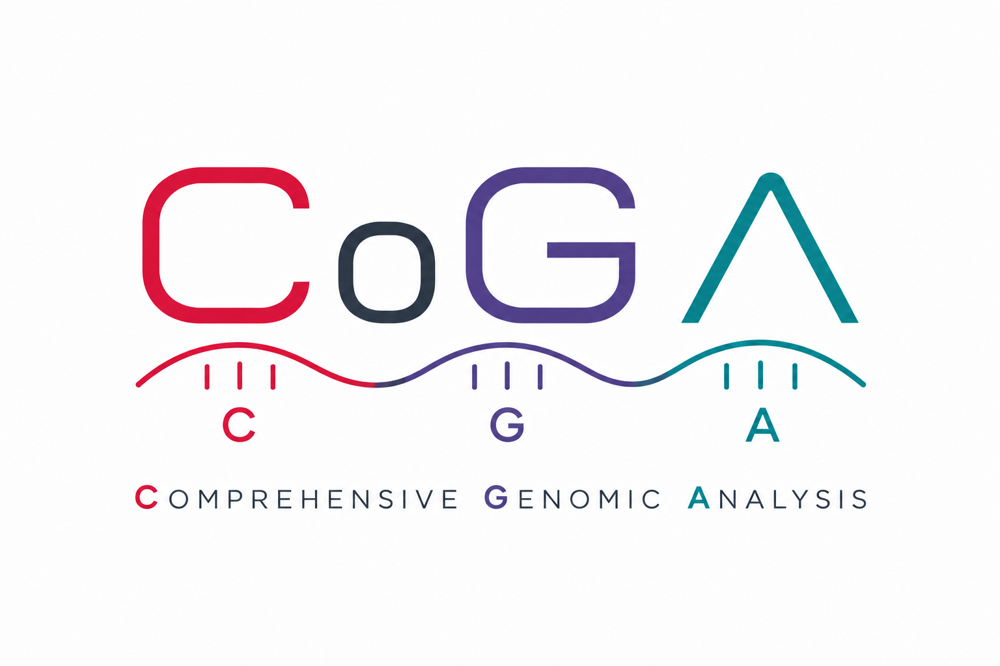

# CoGA

CoGA (Comprehensive Genomic Analysis) is a web application for interpreting a family's
genome data and writing the clinical report. A lab user opens a family, sees its pedigree,
phenotypes and sample QC, filters and classifies the variants, and signs out the report.
CoGA starts from variant files that an upstream pipeline has already called and annotated;
it does not call variants itself.

It serves five clinical applications: rare-disorder diagnostics, expanded carrier screening,
preimplantation genetic testing (PGT), monogenic non-invasive prenatal testing (NIPT), and
combined mitochondrial and nuclear testing for mitochondrial disease.

## Regulatory status

CoGA is operated as an **in-house IVD under IVDR Article 5(5)** by the Center for Medical
Genetics Ghent (CMGG), under its ISO 15189 accreditation. The device boundary is _annotated
VCF → signed clinical report_. CoGA is **not CE-marked**: its validation covers CMGG's own
laboratory and workflow and does not travel with the source code. Anyone who deploys it for
diagnostic use elsewhere is responsible for their own conformity assessment (see
[NOTICE](NOTICE)).

Every change goes through CMGG's change control
([TF-18](docs/regulatory/TF-18-change-configuration-management.md)), so a pull request is
never merged on technical merit alone. The technical file is in
[docs/regulatory/](docs/regulatory/README.md).

All data in this repository is synthetic. There is no production deployment yet; the target
is Google Cloud, deployed with Terraform.

## What it does

- **Family workspace** — pedigree, phenotypes (HPO) and sample QC, and a view for each type
  of data the family has: small variants, structural variants and CNVs, repeat expansions,
  Paraphase, mitochondrial DNA and monogenic NIPT.
- **Interpretation** — filtering and phenotype-based ranking, tags and notes, and a
  semi-automatic ACMG/AMP classifier in which the reviewer can override every criterion.
- **PGT haplotyping** — founder-coloured haplotypes across the pedigree and an embryo
  classification, also for families with one known parent and a donor.
- **Genome views** — whole-genome and chromosome views, a Circos plot and an embedded IGV
  browser.
- **Sign-out** — a versioned record of the report, bound to the software version and the
  annotation and reference versions. Sign-out is refused for a family on an assembly outside
  the validated scope, and needs an acknowledgement with a reason when the evidence behind a
  classification has changed or sample QC flags a possible sample swap. Sign-outs and changes
  to small-variant classifications are kept in an append-only, hash-chained audit trail.
- **Explorers** — genes (with MANE and RefSeq transcript badges), small variants across every
  project you can access, clinical CNVs, HPO terms and gene panels.
- **Administration** — users and projects, family-package import, reference data, ClickHouse
  maintenance and audit logs.

## Where to start

| You want to… | Read |
| --- | --- |
| Use CoGA in the lab | The user guide inside the app, at `/docs` (source in [frontend/src/content/docs/](frontend/src/content/docs/)) |
| Run it locally or change the code | [docs/development.md](docs/development.md), then [CONTRIBUTING.md](CONTRIBUTING.md) |
| See how it is built | [docs/application-scheme.md](docs/application-scheme.md) |
| Deploy and operate it | [docs/deployment-gcp.md](docs/deployment-gcp.md) and [RELEASING.md](RELEASING.md) |
| Review or audit it | [docs/regulatory/README.md](docs/regulatory/README.md) (technical file) and [docs/handleiding/README.md](docs/handleiding/README.md) (Dutch technical manual) |

Every document is listed in [docs/README.md](docs/README.md).

## Try it locally

With Docker installed, from the repository root:

```bash
cp .env.example .env
docker compose -f docker-compose.yml -f docker-compose.dev.yml up --build -d
```

Open <http://localhost:3000> and sign in with `ADMIN_EMAIL` and `ADMIN_PASSWORD` from `.env`.
To load a synthetic family, see [demo/](demo/README.md). Other ways to run CoGA, and how to
reset it, are in [docs/development.md](docs/development.md).

## Licence, security and contributing

- Licensed under the **Apache License 2.0** — see [LICENSE](LICENSE) and [NOTICE](NOTICE).
- Report a security problem privately, as [SECURITY.md](SECURITY.md) describes.
- To contribute, read [CONTRIBUTING.md](CONTRIBUTING.md); participation is governed by
  [CODE_OF_CONDUCT.md](CODE_OF_CONDUCT.md).
- Notable changes are in [CHANGELOG.md](CHANGELOG.md).
