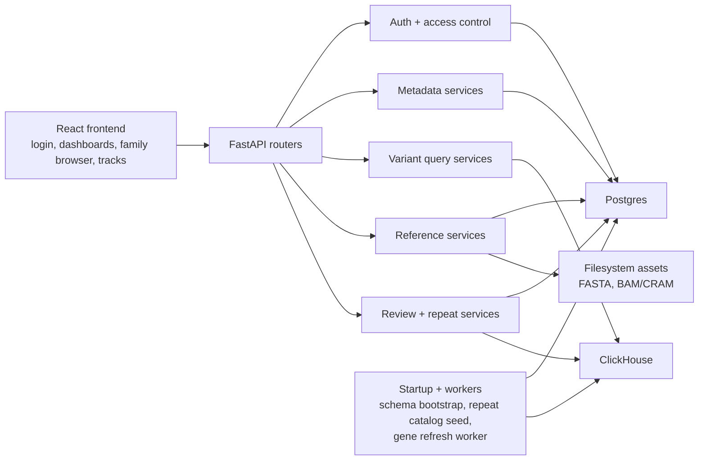

# Application Scheme

## Flow Summary

- Frontend requests hit FastAPI routers.
- User identity and project/family/sample scope are resolved from Postgres.
- Metadata and reference endpoints read from Postgres.
- Small variant and structural variant endpoints query ClickHouse.
- Review annotations, repeat expansions, panels, and track availability are assembled from Postgres and joined onto variant responses.
- Reference sequence and read endpoints also use local filesystem assets.

## Main Code Areas

- `backend/app/core/`: settings, Postgres, ClickHouse, Azure auth helpers
- `backend/app/routers/`: API surface
- `backend/app/services/metadata_service.py`: metadata and access control
- `backend/app/services/clickhouse_family_variants.py`: family-scoped variant queries
- `backend/app/services/variant_upload_service.py`: variant ingestion
- `backend/app/services/bed_service.py`: interval-track ingestion and retrieval
- `backend/app/services/repeat_expansion_pg.py`: repeat catalog and sample calls

## Storage Boundary

- `Postgres` is authoritative for metadata and state.
- `ClickHouse` is authoritative for variant payloads.
- No MongoDB collections remain in the application architecture.
