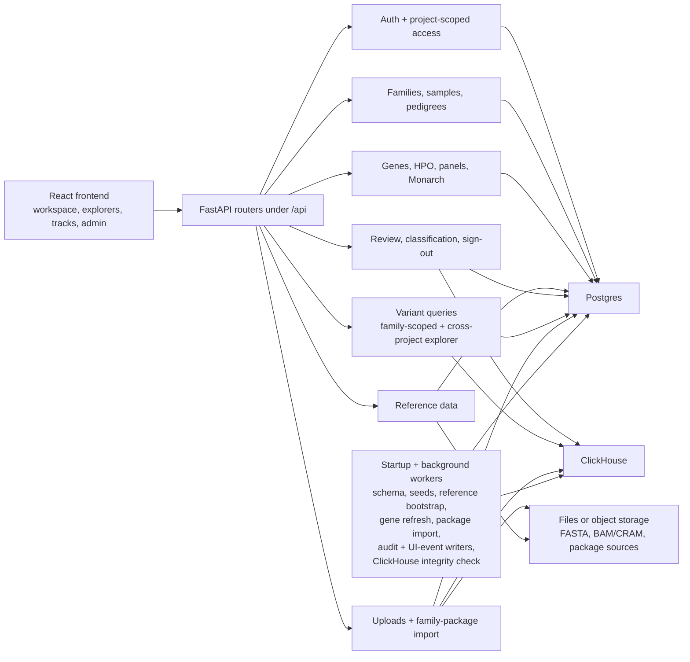

# Application Scheme

How CoGA is put together: its parts, which database holds what, what happens on a request
and at startup, and where to find the code. Every table is described in
[database.md](database.md); the Google Cloud setup is in [deployment-gcp.md](deployment-gcp.md).

```mermaid
flowchart LR
    UI["React frontend<br/>workspace, explorers, tracks, admin"] --> API["FastAPI routers under /api"]

    API --> AUTH["Auth + project-scoped access"]
    API --> META["Families, samples, pedigrees"]
    API --> VAR["Variant queries<br/>family-scoped + cross-project explorer"]
    API --> GENE["Genes, HPO, panels, Monarch"]
    API --> REF["Reference data"]
    API --> REVIEW["Review, classification, sign-out"]
    API --> IMPORT["Uploads + family-package import"]

    AUTH --> PG["Postgres"]
    META --> PG
    GENE --> PG
    REF --> PG
    REVIEW --> PG
    REVIEW --> CH["ClickHouse"]
    VAR --> CH
    VAR --> PG
    IMPORT --> PG
    IMPORT --> CH

    IMPORT --> FS["Files or object storage<br/>FASTA, BAM/CRAM, package sources"]
    REF --> FS

    JOBS["Startup + background workers<br/>schema, seeds, reference bootstrap,<br/>gene refresh, package import,<br/>audit + UI-event writers,<br/>ClickHouse integrity check"] --> PG
    JOBS --> CH
```

## Storage boundary

Postgres is authoritative for metadata and state. ClickHouse is authoritative for variant
payloads.

- **Postgres** holds the users and their project access; species, assemblies, chromosomes,
  genes and the other reference data; families, samples, pedigrees and their projects;
  reviews, classifications, tags and filter presets; repeat expansions, Paraphase results and
  the NIPT artifact list; gene panels, HPO and Monarch data; the sequencing-QC limits and
  their append-only change history; the ranking cache; the source records of the interval
  tracks; and the traceability records: the annotation manifest, the append-only,
  hash-chained clinical audit and sign-out tables, and the integrity anchors. The schema is
  five idempotent baseline files in `backend/db/schema/postgres/` (`01_access.sql` to
  `05_grants.sql`), applied in name order on every start; there is no migration ledger.
- **ClickHouse** holds, for each assembly, the small variants (details, annotations and their
  indexes, the per-sample calls in `entries`, and per-family summaries), the structural
  variants and CNVs, and the interval tracks: coverage, WisecondorX segments, APCAD, PCF
  APCAD segments and haplotypes. The SQL file in `backend/db/schema/clickhouse/` only creates
  the database. An assembly's tables are created the first time it is used, by
  `clickhouse_variant_storage.py` and `clickhouse_interval_tracks.py`.

[database.md](database.md) lists every table and the file that defines it. Metadata IDs are
UUIDs.

### Storage identity

A variant is known everywhere by its variant ID, a string that depends neither on the storage
nor on the callset. Reviews, classification evidence snapshots, the ranking cache and the
SV→gene index attach by it. A row in ClickHouse is one callset's call of one variant, in one
family and one project: its sort key ends with the callset (`source`). So a direct call and an
imputed call of one variant, or two callers' calls of one SV, are separate rows, and a part
merge keeps both. The diagnostic lists show the direct call, and the SV list shows an SV once
per caller. The backend refuses to start on a table whose sort key leaves the callset out, and
on a small-variant calls table without the per-call `calls.filters` and `calls.metrics`
columns. The sort keys, how the storage keys are built and the recovery steps are in
[database.md](database.md#row-identity).

## Runtime flow

1. The browser calls the API under `/api`. Locally the frontend server, or the Vite dev
   server, forwards these calls to the backend; on Google Cloud the load balancer sends
   `/api` to the backend service.
2. The backend identifies the user and checks the requested family, sample or project
   against the user's projects in Postgres.
3. Metadata, reference, gene, HPO and panel endpoints, and the Gene Explorer, read from
   Postgres only.
4. Variant endpoints read the family's records from ClickHouse and join the review state
   (classifications, tags, notes) back from Postgres. The Global Small Variant Explorer
   counts carriers straight from the `entries` tables of every project the user can access,
   at query time.
5. Uploads and package imports write metadata to Postgres and the variant and interval rows
   to ClickHouse, and record each source file with its SHA-256 checksum (an alignment that
   stays in a bucket with the bucket's record of it instead). Alignments (BAM/CRAM) and
   package sources are read from the local disk or from object storage (S3 or Google Cloud
   Storage), as `STORAGE_BACKEND` sets. A package in a bucket is copied for the import except
   its alignments, which the genome browser reads from the bucket. The writes of one family's
   variants (uploads, package imports, and the admin, PED and structure-change deletes) run one
   at a time: each holds the family's write lock in Postgres from its first read of the rows it
   replaces until it commits, whichever worker or process runs it
   ([database.md](database.md#one-write-at-a-time-per-family)).
6. Sign-out freezes the report's content, with the software and reference versions, into an
   append-only, hash-chained record ([clinical-traceability.md](clinical-traceability.md)).

## Startup and background work

On start the backend (`backend/app/main.py`):

1. waits for Postgres, applies the schema files and makes sure the admin user exists. With
   `POSTGRES_RUN_SCHEMA_MIGRATIONS_ON_STARTUP=false` it skips this, so that the schema can be
   applied separately and the API can run as the restricted database role
   ([db-runtime-role-runbook.md](db-runtime-role-runbook.md));
2. starts the writers for the audit log and the UI events;
3. seeds the built-in repeat catalogue; makes sure GRCh38 exists, with its cytobands (from
   UCSC) and gene loci (from GENCODE, or the UCSC gene track when GENCODE cannot be fetched);
   imports T2T-CHM13 as well when `REFERENCE_BOOTSTRAP_T2T` is set; loads the HPO ontology if
   none is loaded; seeds the built-in reference tracks (clinical CNVs, segmental
   duplications); and queues the first gene-reference sync when the local dbNSFP gene file is
   present and no gene information is cached;
4. waits for ClickHouse and creates the database; refuses to start when a variant table's sort
   key leaves the callset out, or the small-variant calls table lacks the per-call FILTER and
   metrics columns ([Storage identity](#storage-identity)); and starts the scheduled
   ClickHouse integrity check;
5. starts the gene-reference refresh worker and the family-package import workers
   (`FAMILY_IMPORT_WORKER_COUNT`).

All of this runs inside the one uvicorn process that serves the API.

## Main code areas

Backend, under `backend/app/`:

- `core/` — shared runtime code: settings, the Postgres and ClickHouse clients, Azure
  sign-in, logging, object storage, and timeouts and retries for outbound requests.
- `routers/` — the API, registered in `routers/__init__.py`.
- `services/access_control.py`, `services/family_metadata_context.py` — the project-scoped
  access check that every family and sample request passes.
- `services/metadata_service.py` — families, samples and projects.
- `services/clickhouse_family_variants.py`, `services/clickhouse_variant_queries.py` —
  family-scoped variant queries and filters; `services/variant_explorer_service.py` — the
  cross-project explorer; `services/variant_ranking_cache.py` — the phenotype-prioritised
  ranking cache.
- `services/family_package_*.py` — the folder-based family-package import;
  `services/variant_upload_service.py` and `services/bed_service.py` — single-file uploads;
  `services/family_variant_write_lock.py` — one write at a time to each family's variants.
- `services/acmg_points.py`, `services/cnv_acmg_points.py` — ACMG/AMP scoring for small
  variants and CNVs.
- `services/annotation_manifest_service.py`, `services/classification_drift_service.py`,
  `services/report_signout_service.py`, `services/clinical_audit_service.py`,
  `services/hash_chain.py`, `services/integrity_anchor_service.py` — traceability and
  sign-out.
- `services/nipt_*.py` — monogenic NIPT; `services/haplotype_lineage_service.py` and
  `services/phased_marker_service.py` — PGT haplotypes; `services/sample_integrity_*.py` —
  sample QC.
- `services/gene_metadata_service.py`, `services/hpo_service.py`, `services/monarch_*.py` —
  the Gene Explorer, HPO and Monarch.
- `services/repeat_expansion_pg.py`, `services/paraphase_pg.py`,
  `services/mitochondrial_analysis.py` — repeat expansions, Paraphase and mtDNA.

Frontend, under `frontend/src/`: `pages/` for the screens, `components/visualizations/` for
the tracks and plots, `lib/api.ts` and `lib/apiPath.ts` for API calls, and `content/docs/` for
the in-app user guide and reference docs.
